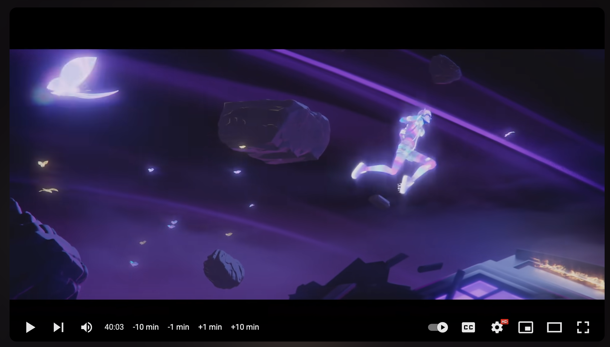

# ytspoilervoider
Tampermonkey/Violentmonkey/Greasemonkey Script to avoid spoilers by hiding youtube video durations

# Add to your userscript extension

### Automatic
If you use tampermonkey, you should be able to click the link below:

[Raw script file](https://raw.githubusercontent.com/peterhieuvu/ytspoilervoider/main/ytspoilervoider.user.js)

### Manual
If that doesn't work, try going to your script extension and either "Import from URL" with the same link. Lastly, you can copy the contents and manually add a new script, pasting the raw contents into the script editor.

# Suggestions?

If you have any suggestions, use github issues to create an issue or just create a pull request 

# Credits

Inspired by: https://chromewebstore.google.com/detail/hide-video-duration-on-yo/jkgpcmmhejecphgdnihjfgmdpdkhgpke?hl=en

